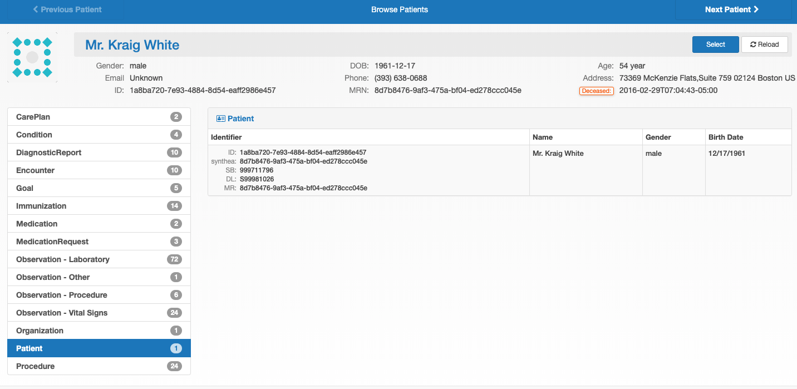
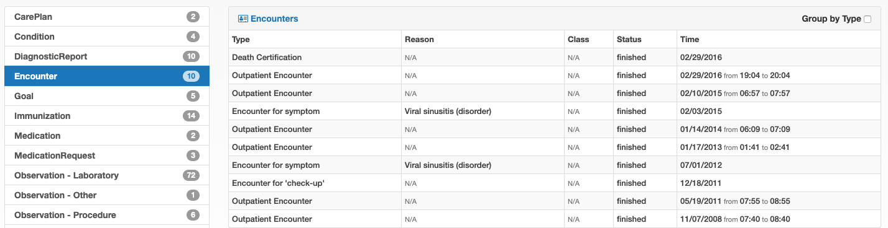

# **Widget Contribution**

Any developer who would like to create the new one. You should do following procedure below:

**note** : Clone or fork our source first via [Github](https://github.com/HMSConnect/hms-widget-sdk)

## **Create widget**

Any widget component, we allow you to create `stateful` or `stateless` component in `JS` style. The widget will import `sub-component` from `standards` component. 

**note** : We recommended you to create your widget inside directory `./app/components/widget/`.

## **Create standards component**

Standard component or sub-component must be `stateless` component in `JS` style. All sub-components should be inside directory `./app/components/standards/[DATA_STANDARD_NAME]/`. By `DATA_STANDARD_NAME` can be :

- `hms_connect` is component of HMSConnect standard
- `smart_fhir` is component of SmartFHIR standard

**note** : Validator should be inside same directory as sub-component too.

**Refer to** : [project structure](/introduction/project_structure)

## **HMS Widget SDK Checklist**
| ResourceType  | Comment  | Sample-data  |  Sample-Image1 |  Sample Image2 |
|---|---|---|---|---|
| Patient  | Patient Search  | patient.json   |   |   |
| Patient |Patent Summary (EHR)   | patient.json,observation,lab.json,diagnosis.json  |   |   |
| Encounter  |Patient Encounter (Visit history)    | Encounter.json   |   | Table View Style  |
       
