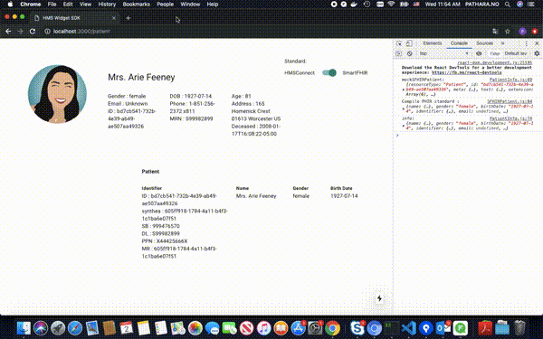
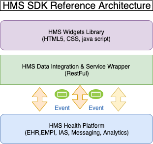

# **HMS Widget SDK**



<span style="text-align:center"><strong>HMS Widget SDK</strong> is healthcare widget provider. We are a part of HMS Software Development Toolkit (HMS-SDK) will be a collection of tools that enable the efficient development of "add-on" applications. 
GLS will host workshops to provide training on the proper use of the HMS-SDK. 
The HMS-SDK fill facilitate writing both local add-on applications and enterprise applications.</span>

## **Reference Architecture Diagram**


## **Installation**

We required dependencies below:

 - [NodeJS](https://nodejs.org/en/download/)
 - [Docker](https://docs.docker.com/install/)
 - [Docker Compose](https://docs.docker.com/compose/install/)
 - [NextJS](https://nextjs.org/docs)
 - [Material-UI](https://material-ui.com/)

## **Usage**

### **Step 1 : Create custom external Docker network**

We declare default network name `iassdk` to communicate between service in Docker compose, you can create the network via command below:

```bash
$ docker network create iassdk
```

### **Step 2 : Start Docker compose with specific environment**

**Development environment**

```bash
# Stop current/previous service in docker compose file "docker-compose.dev.yml"
$ docker-compose -f docker-compose.dev.yml down -v

# Start service in docker compose file "docker-compose.dev.yml"
$ docker-compose -f docker-compose.dev.yml up --build -d
```

**Production environment**

```bash
# Stop current/previous service in docker compose file "docker-compose.prod.yml"
$ docker-compose -f docker-compose.prod.yml down -v

# Start service in docker compose file "docker-compose.prod.yml"
$ docker-compose -f docker-compose.prod.yml up --build -d
```

### **Alternative step**

Just run

```bash
# Development environment (calling "docker-compose.dev.yml")
$ sh run.sh dev

# Or 

# Production environment (calling "docker-compose.prod.yml")
$ sh run.sh prod
```

**Note** : You can check running log via command:
```bash
$ docker-compose -f docker-compose.dev.yml logs
```

### **Final step**

Enjoy with sample widget!

**note**:port number `3000` is development environment

```http
http://localhost:3000/patient
```

## **Detail**

Please refer to our [document](https://hmsconnect.github.io/hms-widget-sdk).

## License

MIT License
