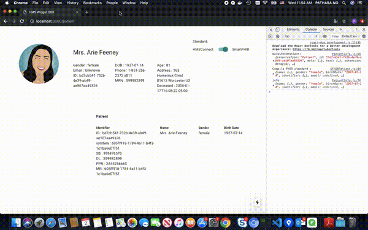

# **Background**

<strong>HMS Widget SDK</strong> is healthcare widget provider. We are a part of HMS Software Development Toolkit (HMS-SDK) will be a collection of tools that enable the efficient development of "add-on" applications. 
GLS will host workshops to provide training on the proper use of the HMS-SDK. 
The HMS-SDK fill facilitate writing both local add-on applications and enterprise applications.

## **Information**

Our widget support multi-healthcare data standards in one component. Currently, we support :

 - `SmartFHIR` standard
 - `HMSConnect` standard