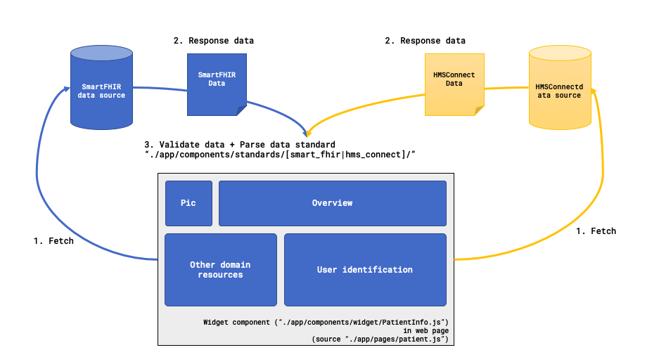

# **Workflow of our widget**

## **Steps** 

1. Main component (widget)
2. Load data from any source
3. Check response data is valid to which standard
4. Compile data with the standard

## **Pseudo code** 

Example below based on `NextJS` syntax.

```js
// Ex. Main component (widget)

// Standard object
import SFHIRPatient from '/some_where1.js';
import HMSPatient from '/some_where2.js';
// Component of each statndard
import SFHIRPatientInfoTable from '/some_where3.js';
import HMSPatientInfoTable from '/some_where4.js';

const HMSPatientObj = new HMSPatient();
const SFHIRPatientObj = new SFHIRPatient();

// ...

export default class Widget extends React.Component {

    constructor(props) {
        // ...

        this.state = {
            patient:null,
            isSFHIRStandard:true
        }
    }

    // ...

    componentDidMount(){
        this.callingAPI(sanboxEndpoint, 'GET', data,
            function(data) {
                if(HMSPatientObj.isValid(data)) {
                    HMSPatientObj.setData(data);
                    info = HMSPatientObj.compile();
                } else if(SFHIRPatientObj.isValid(data)) {
                    SFHIRPatientObj.setData(data);
                    info = SFHIRPatientObj.compile();
                } else {
                    alert('Sorry, we are not support current data standard!')
                }
                
                if(info) {
                    console.log('info:', info)
                    _this.setState({ patient:info });
                }
            }
        );
    }

    // ...

    render(){
        const { patient, isSFHIRStandard } = this.state;
        return (
            <div>
            {
                <PatientInfoTable info={patient} />
            }
            </div>
        )
    }
}
```



?> **note** : data standard classification is in step#3.