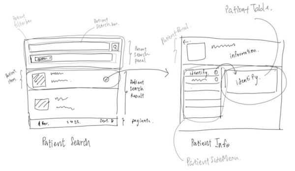
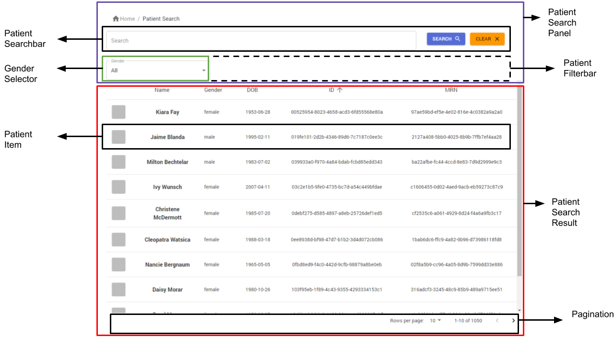
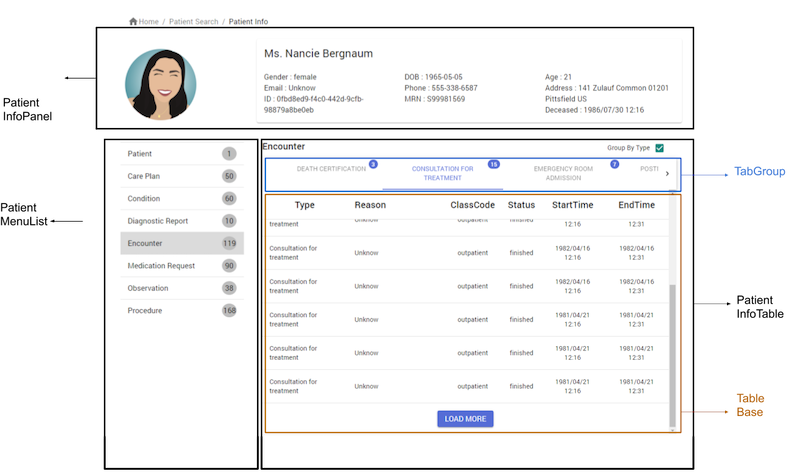
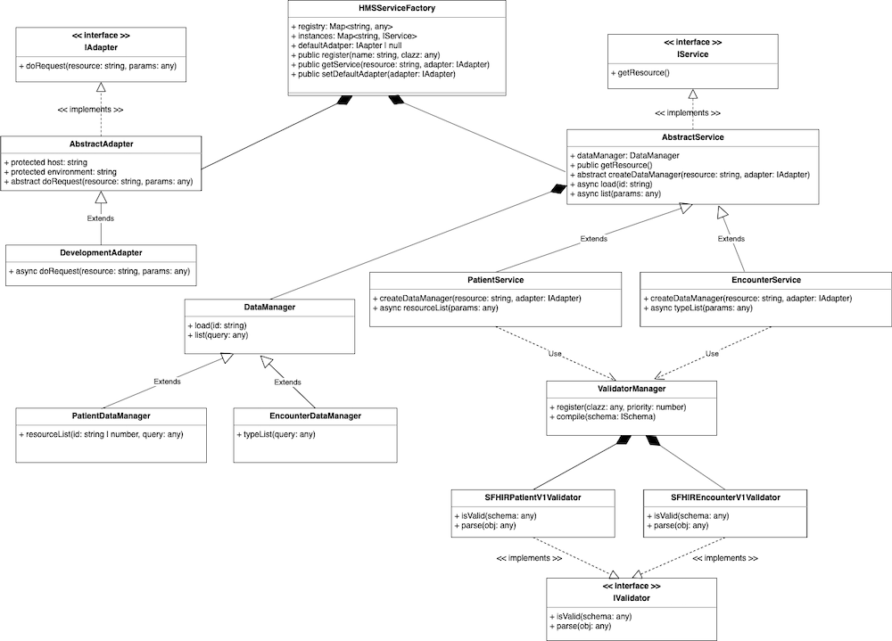

**Patient Search Result Release**

In sprint 1, the main objective is to create the Patient Search Widget that can search by name, last name, identification (MR) and gender.

## Client Widget Component

<div style="text-align:center">
  
</div>

Overview
In sprint 1, form client side there are two widgets that we have progress
1. Patient Search Widget is the widget that we will release in this sprint
2. Patient Info Widget is the widget that represents the patient information such as name, family name, also including encounter’s information that relates to each patient 

Widget detail

1. Patient Search Widget

<div style="text-align:center">
  
</div>

Component | Type | Feature
-- | -- | --
Gender Selector | widget | This widget using for filters patient by gender, which can filter by three types, Male, Female, and any gender
Patient Search | widget | This widget represents the list of patients **data**, which can search by name, last name, identification’s data, or gender. There are three components that are wrapped, Patient Search Panel, Patient Search Result, and Pagination
Patient Search Panel | template | This template is a group of components that use for search patients, which include two components, Patient Filter Bar and Patient Search Bar
Patient Filter Bar | template | Patient Filter Bar use to filter by Dropdown component, now we have one component is Gender Selector
Patient Search Bar | template | Patient Search Bar use to search by name, last name or identification (Passport, MRN, HN)
Patient Search Result | template | This template represents the list of patients, which include one component is Patient Item. This template can sort information of patient by given name, gender, birthdate, ID, and MR
Patient Item | template | This component using for show information of a patient also including onClick event that navigates to Patient Info widget
Pagination | base | This base component is to handle paginate function of the list of data

**type Describe**

Type | Description
-- | -- 
base | as same as components in Material-UI library (Stateless) such as Button, Grid, Input
template | many bases/templates combined (Stateless) such as Searchbar
widget | many templates combined (Stateful) and ready to use such as PatientSearch

2. Patient Info Widget

<div style="text-align:center">
  
</div>

Component | Type | Feature
-- | -- | --
Gender Selector | widget | This widget using for filters patient by gender, which can filter by three types, Male, Female, and any gender
Patient Search | widget | This widget represents the list of patients data, which can search by name, last name, identification’s data, or gender. There are three components that are wrapped, Patient Search Panel, Patient Search Result, and Pagination
Patient Search Panel | template | This template is a group of components that use for search patients, which include two components, Patient Filter Bar and Patient Search Bar
Patient Filter Bar | template | Patient Filter Bar use to filter by Dropdown component, now we have one component is Gender Selector.
Patient Search Bar | template | Patient Search Bar use to search by name, last name or identification (Passport, MRN, HN). Patient item will be highlighted if search text includes the patient name
Highlighter | base | This base component use to highlight text by map with search text
Patient Search Result | template | This template represents the list of patients, which include one component is Patient Item.This template can sort information of patient by given name, gender, birthdate, ID, and MR
Patient Item | template | This component using for show information of a patient also including onClick event that navigates to Patient Info widget
Pagination | base | This base component is to handle paginate function of the list of data


## Client Integration Middleware

<div style="text-align:center">
  

  draw.io: [`link`](https://drive.google.com/file/d/1UIMrMt_9jJRlCi8JwocuiWTBXK0Y1jv-/view?usp=sharing)
</div>


## Fake API/Mock API

All structures that have been updated, as shown below.
```
|-- fake
|   |-- server.js
|   |-- storage.js
|   |-- apis
|   |   |-- v1
|   |   |   |-- patient.js
|   |   |   |-- encounter.js
|   |   |   |-- care_plan.js
|   |-- services
|   |   |-- patient.js
|   |   |-- encounter.js
|   |   |-- care_plan.js
|   |   |-- utils
|   |   |   |-- index.js
```
description of this structure
1. server.js
   - we register apis router with node express, as shown below.
    ```javascript
      app.use('/smart-fhir/patient', require('./apis/v1/patient'))
      app.use('/smart-fhir/encounter', require('./apis/v1/encounter'))
      app.use('/smart-fhir/care-plan', require('./apis/v1/care_plan'))
    ```
2. storage.js
   - we update method processingPredata for Mock metadata  in file storage.js
     - pre-data → pre-process data use for query the mini-mongo that restructure data to the object `__mock_meta`.
     - post-data →  post-process data for excluding the object `__mock_meta` when complete the process query resource from the mini-mongo.
3. apis
   - now, We support API 3 domain resource.
     - patient

        Verb | Path | Filter Support | Result
        -- | -- | -- | -- |
        **GET** | /patient | gender, searchText (identifier, name.family, name.given) | patient list
        **GET** | /patient/:id | - | specific patient 
        **GET** | /patient/:id/resource-list | - | group all resource list following specific patient
 
     - encounter

        Verb | Path | Filter Support | Result
        -- | -- | -- | -- |
        **GET** | /encounter | patientId, periodStart_lt | encounter list
        **GET** | /encounter/:id | - | specific encounter 
        **GET** | /encounter/type | - | group all type of encounter

     - care-plan 
        Verb | Path | Filter Support | Result
        -- | -- | -- | -- |
        **GET** | /care-plan | patientId, periodStart_lt | care-plan list
        **GET** | /care-plan/:id | - | specific care-plan 
        **GET** | /care-plan/type | - | group all type of care-plan

    - for API response, We query API include error, schema, data, and totalCount.
      ```json
        {
          "error": null,
          "schema": {
              "version": number,
              "standard": string,
              "resourceType": string
          },
          "data": [
            ...
          ],
          "totalCount": number
      }
      ```

      - **Schema** 
        - We provide schema is version, standard, resourceType for compile validate standard.
          - version -- for filter each structure standard resource.
          - standard -- for show type standard insist of SFHIR, HMS Standard.
          - resourceType -- display domain resource.
      - **Data**
        - We provide data 2 types contain array and object following each type.
      - **TotalCount**
        - total count for paginate 
4. services
    - consist of utils, patient, care_plan for support pre-data, resource, and options.
    - **description**
      - Predata for each domain resource such as creating patient meta_mock for query identifier.
        ```javascript
          exports.processingPredata = data => {
            const identifier = {}

            for (const id of data.identifier) {
              if (id.type) {
                identifier[id.type.coding[0].code.toLowerCase()] = id.value
              } else {
                const systemWords = id.system.split('/')
                const systemLastWord = systemWords[systemWords.length - 1].toLowerCase()
                identifier[systemLastWord] = id.value
              }
            }
            return {
              ...data,
              __mock_meta: {
                identifier
              }
            }
          }

        ```
    - selector creating for query mini mongo
      - the feature Selector for query in the Mini-Mongo from query-string. 
    - options creating for query mini mongo
      - the feature for creating options for sort from query-string.