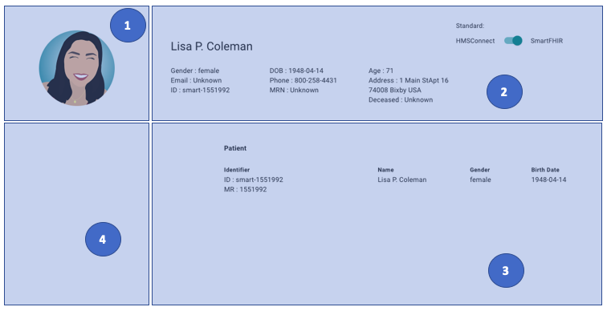

# **Sample widget**

For `<PatientInfo/>` in previous session or our sample `widget` has 4-components inside it, including :



?> **note** : any component below used component's style of `Material-UI`

**1. Avatar area**

This component using for shows user picture.

```js
    <Grid item xs={12} sm={3}>
        <Avatar 
            alt="Remy Sharp" 
            src="../../static/images/mock-person-profile.png" 
            className={classes.bigAvatar} />
    </Grid>
```

**2. Info panel area**

We plan to show overview user/patient info in info panel area.

```js
    <Grid container spacing={3}>
    {
    <PatientInfoPanel info={patient}/>
    }
    </Grid>
```

?> **note** : for this area, it supports both data standards(`SmartFHIR` and `HMSConnect`).

At the top-right corner of the screen, we provide trigger to switch data source between SmartFHIR and HMSConnect. It makes developer easy to check relation between data schema and component. But we will not adding the feature in real use.

```js
    <Grid container spacing={3}>
        <Typography component="div">
        <small>Standard:</small>
        <Grid component="label" container alignItems="center" spacing={1}>
            <Grid item><small>HMSConnect</small></Grid>
            <Grid item>
            <Switch 
                name='isSFHIRStandard'
                checked={isSFHIRStandard} 
                onChange={(e) => this.handleSwitchChange(e)} 
                value="smart_fhir" />
            </Grid>
            <Grid item><small>SmartFHIR</small></Grid>
        </Grid>
        </Typography>
    </Grid>
```

**3. Info table area**

Info table using for show detail of user/patient info.

```js
    <Grid item xs={12} sm={8}>
    {
        <PatientInfoTable info={patient} />
    }
    </Grid>
```

?> **note** : for this area, it supports both data standards(`SmartFHIR` and `HMSConnect`).

**4. Domain resource list area**

For now, the area has nothing.

```js
    <Grid item xs={12} sm={4}></Grid>
```

!> **IMPORTANT** :
<br/> We prepare to add domain resource list in this area.