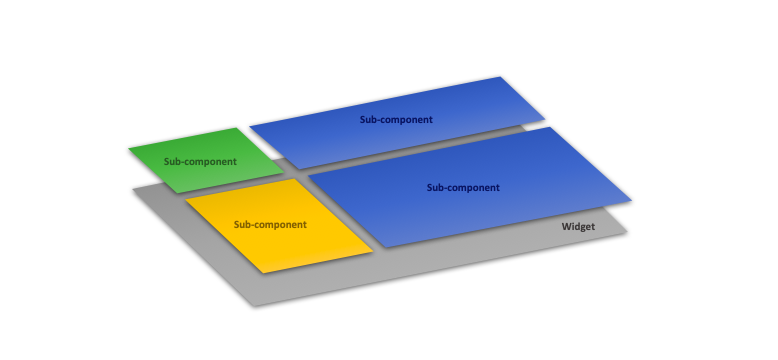

# **What is the widget?**

The widget in our meaning is page or any component which contains multi-components to render user(patient) info on it, example data table, panel, list view, graph, ..., etc.

